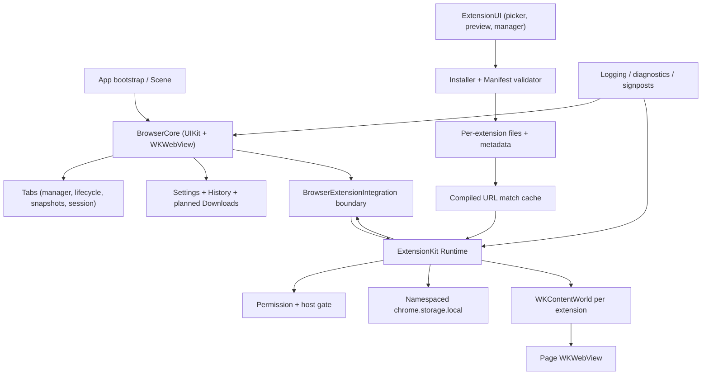
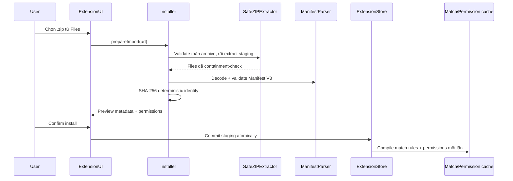

# ExtensionBrowser Architecture

Tài liệu này ghi lại các quyết định của MVP, boundary giữa các module, security model và giới hạn có chủ ý. `project.yml` cùng source Swift là nguồn sự thật khi tài liệu và implementation khác nhau.

## Mục tiêu và non-goals

MVP cần chứng minh hai luồng chạy được:

```text
input URL/search -> WKWebView -> nhiều tab -> suspend/restore khi memory pressure

extension.zip -> validate -> preview quyền -> install/enable
              -> match navigation -> inject JS/CSS -> chrome.* bridge giới hạn
```

Ưu tiên là native iOS behavior, thời gian chuyển tab, memory bounded, package validation và một CI không cần Mac local. MVP không nhằm thay WebKit bằng Chromium, tương thích toàn bộ Chrome Extension API, chạy native code từ extension hoặc phát hành App Store tự động.

## Sơ đồ module



Dependency direction quan trọng: browser không phụ thuộc trực tiếp vào UI extension. `BrowserExtensionIntegrating` và `BrowserExtensionHost` là boundary hẹp để runtime cấu hình `WKUserContentController`, nhận navigation events, query/create tab mà không đưa toàn bộ `TabManager` vào ExtensionKit.

## Module ownership

| Module | Trách nhiệm | Không nên chứa |
|---|---|---|
| `App` | Bootstrap window/scene, compose browser và extension runtime | Parsing ZIP, tab business logic |
| `BrowserCore` | Browser view controller/view model, navigation UI, URL resolution, WKWebView lifecycle hooks | Extension storage/manifest parsing |
| `Tabs` | Tab model, select/create/close/reorder, lifecycle plan, snapshot, session persistence | Toolbar/layout logic |
| `ExtensionKit` | Install/validate/index/inject, permissions, bridge APIs, storage | UIKit presentation |
| `ExtensionUI` | Files picker, install preview, list/details/toggle/remove | ZIP extraction trên main actor |
| `Settings` | Search engine built-in/custom và debug UI | Browser rendering core |
| `History` | Actor store JSON + UIKit list/clear/open; chỉ record tab thường | Extension hoặc private-tab state |
| `Downloads` (planned) | Boundary cho download feature về sau; chưa implement trong MVP | Không được mô tả như feature đã ship |
| `Shared` | Logging, signposts, diagnostics, integration protocols | Feature business logic lớn |

## Browser core và WKWebView

`BrowserViewController` giữ responsibility UI: address field, progress, toolbar, attach/detach view của tab đang chọn và present feature screens. `TabManager` giữ state/operations; controller không sở hữu toàn bộ business logic.

`WebViewConfigurationProvider` tạo configuration theo privacy class:

- Normal tabs chia sẻ `WKProcessPool` và `WKWebsiteDataStore.default()` để giữ session/cookie hợp lý.
- Private tabs dùng process pool riêng và `WKWebsiteDataStore.nonPersistent()`.
- Mỗi web view có `WKUserContentController` riêng, tránh handler/script của tab này rò sang tab khác.
- Extension runtime chỉ được cấu hình cho normal tab. Private tab không đi qua integration point của extension trong MVP.
- `WKWebView` chỉ được tạo khi tab cần live content; chuyển tab không tự động recreate web view.

Address input được resolve theo thứ tự: URL HTTP/HTTPS explicit, hostname/IP/localhost suy luận với HTTPS, rồi search engine. `SearchEngine` dùng template `{query}` và validate scheme/host trước khi lưu custom engine.

## Tab lifecycle và persistence

Ba state là giá trị dữ liệu thật, không chỉ nhãn UI:

| State | Nội dung giữ lại | Hành vi |
|---|---|---|
| `ACTIVE` | live `WKWebView`, model, có thể có snapshot | Tab đang hiển thị và nhận interaction |
| `WARM` | live `WKWebView` cho tối đa các tab background gần nhất | Chuyển lại nhanh, không reload |
| `SUSPENDED` | metadata + snapshot + URL, release `WKWebView` | Hiện snapshot trước, tạo/load web view phía sau |

`TabLifecycleManager` là pure planner: chọn active tab, tối đa ba warm tabs gần nhất và phần còn lại suspended. Khi memory warning, chế độ aggressive đưa warm limit về 0 nhưng giữ active tab. `TabSnapshotManager` xử lý ảnh ngoài controller; `TabStore` là actor và ghi session JSON atomically với `schemaVersion` để dành chỗ cho migration.

Private tabs không được đưa vào normal session persistence. Restore của MVP là URL/snapshot, không thể serialize JavaScript heap, form state hay toàn bộ `WKBackForwardList`; đây là giới hạn nền tảng cần thể hiện trong UX.

## Extension install pipeline



Archive được validate toàn bộ trước khi extract. Central directory được duyệt lazy và dừng ngay khi thấy entry thứ 2.001. Default limits hiện tại:

| Limit | Giá trị |
|---|---:|
| ZIP đầu vào | 50 MiB |
| Số entries | 2,000 |
| Một entry sau giải nén | 16 MiB |
| Tổng dung lượng sau giải nén | 100 MiB |
| Compression ratio cho file lớn | 250:1 |

Path được chuyển sang dạng forward-slash chuẩn và reject nếu absolute, có `..`/`.`/empty component, backslash, NUL, drive-letter Windows, tilde prefix, dài quá giới hạn hoặc thoát staging root sau standardization. Duplicate paths được so sánh case-insensitive + Unicode precomposition. Symlink bị reject. CRC được xác minh trong lúc extract và file output đặt permission không executable.

File có extension native (`dylib`, `so`, `framework`, `bundle`, object/archive, executable/app/IPA...) bị reject; magic bytes Mach-O/fat binary, ELF và PE cũng bị kiểm tra sau extraction. Đây là defense-in-depth, không phải antivirus cho JavaScript độc hại.

Extension ID là 32 ký tự hex đầu của SHA-256 trên danh sách path/content canonical của package. Full digest được giữ trong metadata để phát hiện collision hoặc package khác dùng cùng ID. Mỗi extension có directory riêng chứa `manifest.json`/metadata, `files/` và `storage/`.

## Manifest, matching và injection

Parser chỉ chấp nhận Manifest V3. Optional fields có default an toàn; name/version/match/resource path được validate. Unknown API permission bị reject thay vì tạo cảm giác tương thích giả. Capability MVP: `activeTab`, `storage`, `tabs`, `scripting` cùng host match patterns.

`WebExtensionMatchPattern` parse pattern thành scheme/host/path expression một lần. `<all_urls>`, exact host, `*.` subdomain, wildcard host/path và scheme được model hóa; `*://` chỉ mở rộng HTTP/HTTPS. `exclude_matches` luôn thắng include. `ExtensionMatchCache` actor giữ compiled content scripts theo extension ID, nên navigation không đọc/parse lại manifest.

Injection policy:

- Chỉ extension enabled và được host gate cho phép mới được inject.
- Resource path luôn resolve bên dưới `files/` của extension.
- JS/CSS phải là UTF-8; lỗi resource/evaluation được log/trả error thay vì crash browser.
- `document_start`, `document_end`, `document_idle` map vào hook WebKit gần nhất mà runtime cung cấp. Timing của WebKit không phải bản sao tuyệt đối Chrome.
- `all_frames` được parse để forward compatibility; main-frame là phạm vi đảm bảo của MVP.
- Mỗi extension dùng logical `WKContentWorld` riêng, tách global JavaScript giữa page và các extension. Content world không ngăn script đọc/thay đổi DOM khi host permission đã được cấp.
- Validator giới hạn 128 rules, 256 match/exclude patterns mỗi rule, 32 resource references mỗi rule và 256 references toàn extension. Source builder cache theo normalized path, giới hạn 4 MiB/resource và 16 MiB tổng source, đồng thời dựng/ghép source ngoài main actor.

## Permission model

Permission state tách declared capabilities, granted capabilities, explicit `host_permissions`, content-script-only match rules, active-tab origins và enabled state. Install UI hiển thị cả host permission lẫn site access từ `content_scripts.matches` trước confirm. Runtime phải qua `ExtensionPermissionManager` trước API nhạy cảm:

- `storage` cho storage namespace của chính extension.
- `tabs` cho query/create tab.
- `scripting` cộng host access cho execute/inject.
- `content_scripts.matches` chỉ cấp quyền cho declarative rule tương ứng; nó không được nâng thành host grant cho popup/programmatic `executeScript`, và `exclude_matches` luôn được áp dụng.
- `activeTab` chỉ cấp origin hiện tại sau một user invocation rõ ràng; grant được revoke khi disable/navigation policy yêu cầu.
- Host access phải match granted pattern hoặc active-tab origin.

MVP grant các declared permissions sau khi user confirm package. Grant theo-domain/revoke UI chi tiết là roadmap.

## `chrome.*` compatibility bridge

Bridge JavaScript gửi envelope gồm extension identity, method và JSON-safe arguments qua `WKScriptMessageHandlerWithReply`. Native registry route theo tên method, validate sender/tab/permission, chạy service actor rồi resolve/reject Promise ở đúng content world. Callback-style Chrome API chưa được hỗ trợ. Page script không được coi extension ID tự khai báo là authority; identity phải gắn với handler/world mà native runtime đã tạo.

API MVP hướng đến:

- `chrome.runtime.sendMessage`, `chrome.runtime.onMessage`.
- `chrome.storage.local.get/set/remove/clear`.
- `chrome.tabs.query/create`.
- `chrome.scripting.executeScript`.
- `chrome.action.getTitle/setTitle` cho title runtime tạm thời. Popup provider render `default_popup` bằng non-persistent `WKWebView`, giới hạn navigation/file root và chặn remote subresources; action toolbar chưa được nối.

Unsupported method phải trả `unsupportedAPI`; malformed args/permission failures dùng typed runtime errors. Mỗi extension storage dùng actor/file namespace riêng và atomic persistence, không trả đường dẫn native ra JavaScript.

## Concurrency và main-thread policy

- UIKit, `WKWebView`, navigation delegate và attach/detach views chạy trên `@MainActor`.
- ZIP enumeration/extraction, hashing, manifest IO, extension index/storage, tab/history persistence chạy async hoặc trong actor/background task.
- Actor ownership được dùng cho mutable cache/store; value models qua boundary là `Sendable` khi khả thi.
- Không `Task.detached` tùy tiện với UIKit/WebKit object. Kết quả background quay lại main actor trước khi thay state UI.
- File writes quan trọng dùng staging + atomic replace/write để tránh metadata nửa chừng khi app bị dừng.

## Persistence và privacy

Normal state được chia theo feature thay vì một database toàn cục:

- Tab session JSON có schema version; snapshot là file riêng để không làm JSON phình lớn.
- Browser settings nhỏ dùng `UserDefaults`; custom search engines encode Codable.
- History dùng actor/file store riêng và browser chỉ record HTTP(S) khi tab thường hoàn tất navigation; private navigation không được ghi. Download store/UI chưa được implement.
- Installed extension metadata/files/storage nằm tại `Documents/Extensions/<id>/` và tách directory theo deterministic extension ID; storage local nằm ở `storage/local.json`.
- Website cookies/cache do normal `WKWebsiteDataStore.default()` quản lý; private data dùng non-persistent store.

Không log page content, extension storage values, signing secrets hoặc raw message payload nhạy cảm trong Release.

## Failure handling

Boundary I/O trả typed/localized errors để UI có thể báo malformed manifest, corrupt ZIP, unsupported permission/API, missing resource hoặc injection failure. Navigation failure giữ browser shell sống. Một extension lỗi không được làm hỏng registry của extension khác. Startup bỏ qua/quarantine record không đọc được thay vì force-cast/crash; migration policy chi tiết sẽ được thêm khi schema thay đổi.

## Performance và observability

- `WKWebView` reuse theo tab state; không rebuild configuration mỗi view update.
- URL match rules compile/cache khi load/install/toggle, không parse manifest theo navigation.
- Snapshot xuất hiện trước restore để tránh màn hình trắng; cache được trim khi memory warning.
- `OSLog` phân category (`app`, `browser`, `tabs`, `extensions`) và Release không spam console.
- `os_signpost` cung cấp điểm mở rộng cho startup, navigation, tab switch, matching và injection; Debug diagnostics đếm live web views, navigation và memory warnings.

Các metric cần profile trên thiết bị thật: p50/p95 tab-switch latency, time-to-first-content sau restore, match/injection duration, live web-view count và memory footprint theo số tab.

## Build system và CI

`project.yml` là cấu hình tái tạo project. XcodeGen được pin `2.46.0` với SHA-256 của release binary; project generated bị ignore. Hai workflow độc lập:

- Simulator: generate, chọn device có thật, unit test, Release simulator build, kiểm tra/zip `.app`, optional Appetize.
- Device: unsigned `xcarchive` + structurally packaged unsigned IPA luôn có; signed archive/export chỉ khi đủ sáu secrets. Partial signing configuration làm job fail rõ ràng sau khi unsigned artifact được upload.

`ExportOptions.plist` được generate bằng `plistlib` với allowlist method `development`/`ad-hoc`. Signing file nằm trong runner temp/keychain tạm, không thuộc repository, và được cleanup best-effort ở cuối job.

## Test strategy

Pure/value/actor logic được ưu tiên unit test không cần UI automation:

- URL input và search templates.
- Tab lifecycle plan, session schema và private filtering.
- Manifest defaults/validation/version/permissions.
- Match pattern include/exclude và rule cache.
- Resource/ZIP path traversal, duplicate/symlink/native magic và security limits.
- Deterministic identity, install collision/rollback.
- Permission and host authorization.
- Storage namespace/atomic persistence và API registry argument routing.

GitHub Actions `xcodebuild test` trên iPhone Simulator là compile/test authority. Windows chỉ có thể kiểm tra JSON/YAML/scripts; không được coi đó là thay thế cho Apple SDK build.

## Known limitations và quyết định hoãn

1. WebKit là engine bắt buộc; compatibility không đồng nghĩa Chrome/Kiwi parity.
2. Không service worker/background page, declarativeNetRequest/webRequest, native messaging, binary module hay Chrome Web Store integration.
3. Action toolbar/lifecycle popup hoàn chỉnh, iframe/all-frames injection, callback APIs và long-lived runtime ports chưa nằm trong success criteria MVP.
4. Content-world isolation tách JS globals nhưng DOM vẫn là shared surface; extension có host access có thể quan sát/sửa page DOM.
5. Tab restore không khôi phục JS heap/form/back-forward list đầy đủ.
6. Private mode cố ý disable extension; UI opt-in riêng chỉ nên thêm sau audit.
7. Signing phụ thuộc external Apple assets/profile/registered devices. Unsigned IPA chỉ là input cho re-sign, không phải artifact cài trực tiếp.
8. Không thể compile iOS trên Windows; lần chạy CI macOS đầu tiên vẫn là bước xác nhận bắt buộc.
9. History đã có store/UI; Downloads chưa được implement. Favicon mới chỉ có candidate URL, chưa fetch/render.

## Điều kiện mở rộng sau MVP

Trước khi tăng compatibility surface, cần ưu tiên: fuzz installer/parser, domain-grant UI, message sender authentication tests, extension update rollback/migration, popup isolation, per-extension resource quotas và device profiling. Mỗi API mới phải có permission mapping, typed argument validation, failure contract, storage/privacy impact và test trước khi đăng ký vào bridge.
